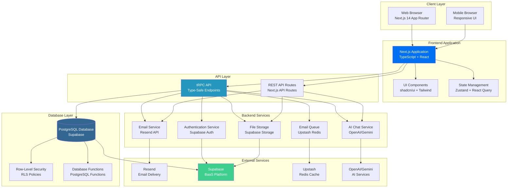
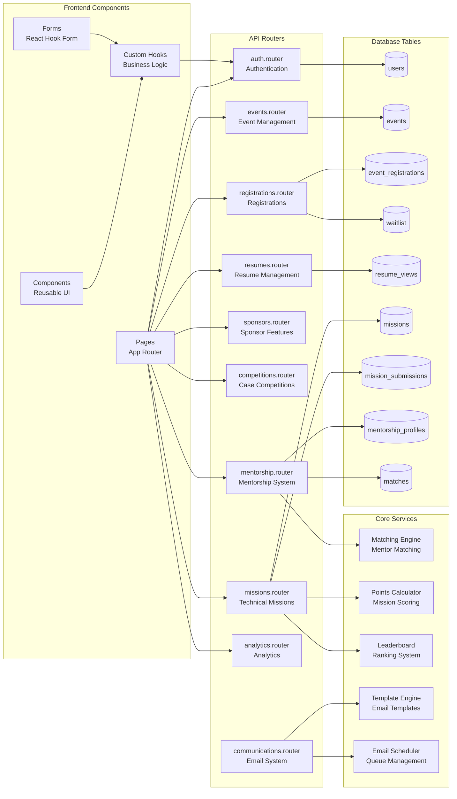
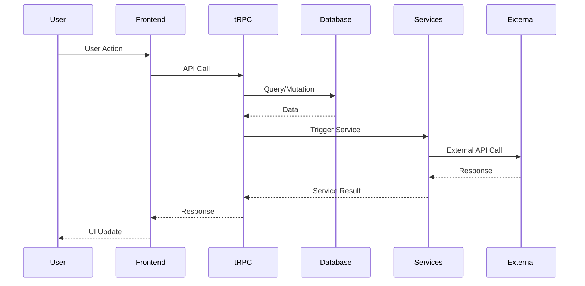
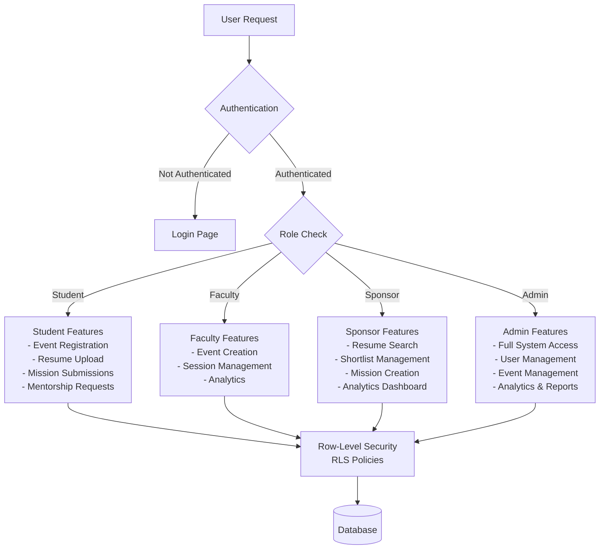
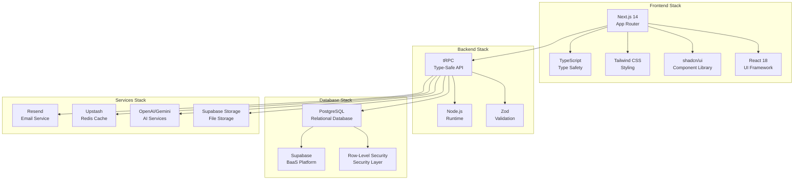
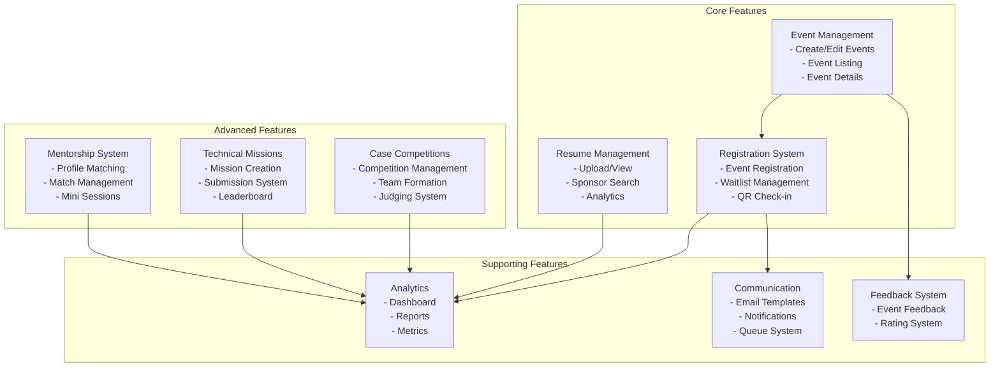
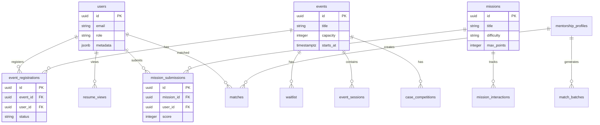
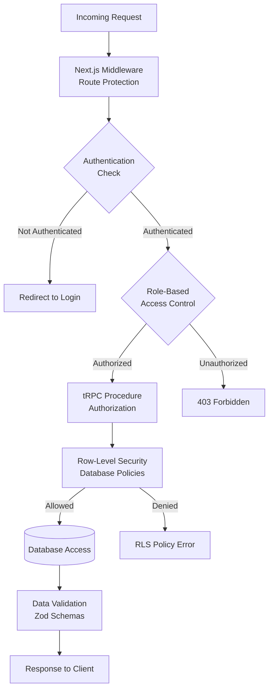
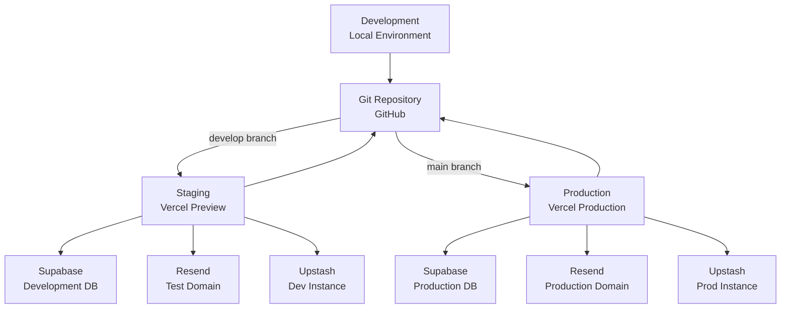

# 🏗️ CMIS Event Management System - Architecture Diagram

## System Architecture Overview

This document provides a comprehensive architectural diagram of the CMIS Event Management System for presentation purposes.

---

## High-Level Architecture Diagram

---

## Detailed Component Architecture

---

## Data Flow Architecture

---

## User Role-Based Access Architecture

---

## Technology Stack Architecture

---

## Feature Modules Architecture

---

## Database Schema Architecture

---

## Security Architecture

---

## Email Communication Architecture

```mermaid
graph LR
    TRIGGER[Event Trigger<br/>Registration/Update]
    
    TRIGGER --> QUEUE_MGR[Queue Manager<br/>Upstash Redis]
    QUEUE_MGR --> TEMPLATE_ENG[Template Engine<br/>Variable Substitution]
    TEMPLATE_ENG --> VARIATION[Variation Selector<br/>A/B Testing]
    VARIATION --> SCHEDULER[Email Scheduler<br/>Batching Logic]
    SCHEDULER --> SURGE[Surge Detector<br/>Rate Limiting]
    SURGE --> RESEND_API[Resend API<br/>Email Delivery]
    RESEND_API --> TRACKING[Email Tracking<br/>Open/Click Analytics]
    TRACKING --> ANALYTICS[Analytics Dashboard]
```

---

## Deployment Architecture

---

## System Statistics

### **API Endpoints**
- **Total tRPC Routers:** 15
- **Total Endpoints:** 150+
- **Public Endpoints:** ~20
- **Protected Endpoints:** ~130

### **Database**
- **Total Tables:** 30+
- **Database Functions:** 20+
- **RLS Policies:** 50+
- **Indexes:** 40+

### **Frontend**
- **Total Pages:** 50+
- **Components:** 100+
- **Custom Hooks:** 15+

### **Features**
- **Event Management:** ✅ Complete
- **Registration System:** ✅ Complete
- **Resume Management:** ✅ Complete
- **Case Competitions:** ✅ Complete
- **Technical Missions:** ✅ Complete
- **Mentorship System:** ✅ Complete
- **Email System:** ✅ Complete
- **Analytics:** ✅ Complete

---

## Key Architectural Decisions

1. **Type Safety:** tRPC provides end-to-end type safety from database to frontend
2. **Security:** Row-Level Security (RLS) at database level for data protection
3. **Scalability:** Serverless architecture with Vercel for auto-scaling
4. **Performance:** Redis caching for frequently accessed data
5. **Modularity:** Feature-based router organization for maintainability
6. **Real-time:** React Query for efficient data fetching and caching

---

## Presentation Notes

### **For Your Presentation:**

1. **Start with High-Level Architecture** - Show the overall system flow
2. **Explain Technology Stack** - Why Next.js, tRPC, Supabase
3. **Highlight Security** - RLS policies, role-based access
4. **Show Feature Modules** - What each module does
5. **Demonstrate Scalability** - Serverless, caching, queue system
6. **End with Statistics** - Show the scale of the system

### **Key Points to Emphasize:**

- ✅ **Type-Safe API** - tRPC ensures type safety across the stack
- ✅ **Secure by Default** - RLS policies protect data at database level
- ✅ **Scalable Architecture** - Serverless deployment with auto-scaling
- ✅ **Feature Complete** - All major features implemented
- ✅ **Modern Stack** - Latest technologies and best practices

---

**Generated for:** CMIS Event Management System Presentation  
**Date:** December 2024  
**Version:** 1.0

